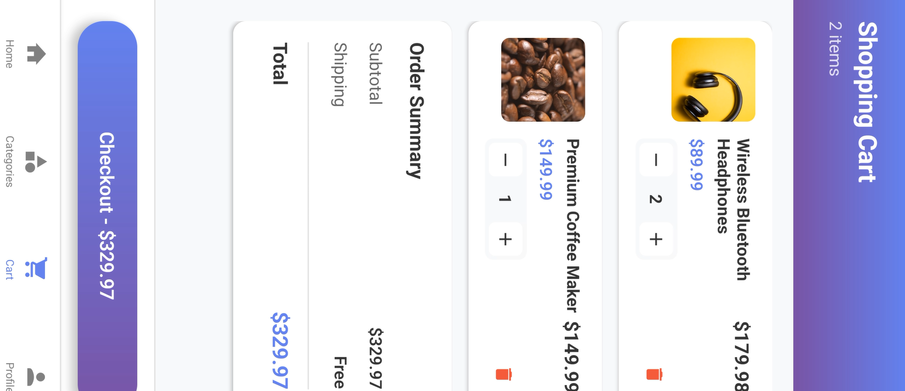
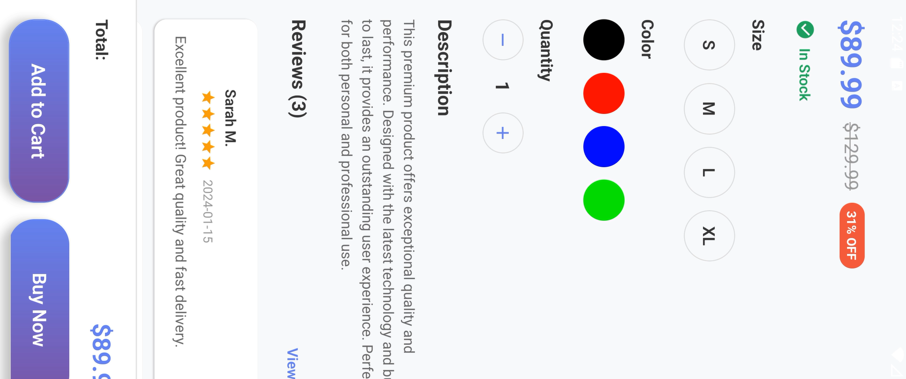
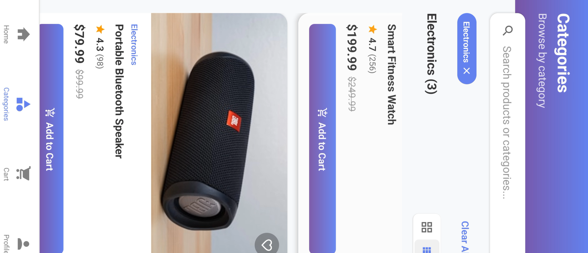
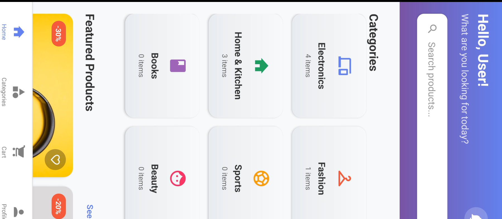
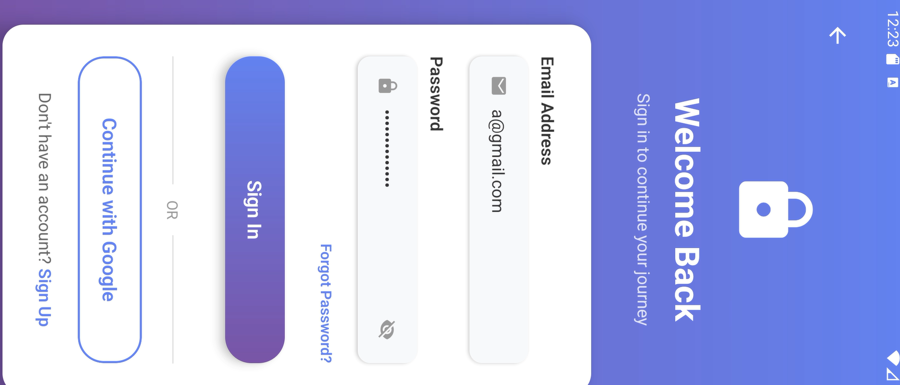

# 🛍️ React Native E-Commerce App

A modern, full-featured e-commerce mobile application built with React Native, Expo, and Firebase. This app provides a complete shopping experience with user authentication, product browsing, wishlist management, and order tracking.

## ✨ Features

### 🔐 Authentication
- **User Registration & Login**: Secure authentication with Firebase Auth
- **Email/Password Authentication**: Traditional login system
- **Persistent Sessions**: Users stay logged in between app launches
- **User Profiles**: Personal information management

### 🛒 Shopping Experience
- **Product Catalog**: Browse products by category
- **Search & Filter**: Find products quickly with search and category filters
- **Product Details**: Detailed product information with images, reviews, and specifications
- **Wishlist Management**: Save favorite products for later
- **Shopping Cart**: Add items to cart and manage quantities
- **Order Management**: Track order status and history

### 🎨 User Interface
- **Modern Design**: Beautiful gradient backgrounds and smooth animations
- **Responsive Layout**: Optimized for different screen sizes
- **Intuitive Navigation**: Easy-to-use tab and stack navigation
- **Loading States**: Proper loading indicators and error handling

### 🔥 Firebase Integration
- **Real-time Database**: Firestore for data persistence
- **Authentication**: Firebase Auth for user management
- **Storage**: Firebase Storage for image uploads
- **Analytics**: Firebase Analytics for user behavior tracking

## 📱 Screenshots

### App Screenshots










## 🚀 Getting Started

### Prerequisites

- Node.js (v14 or higher)
- npm or yarn
- Expo CLI
- Firebase account

### Installation

1. **Clone the repository**
   ```bash
   git clone <your-repo-url>
   cd react-native-ecommerce-app
   ```

2. **Install dependencies**
   ```bash
   npm install
   ```

3. **Firebase Setup**
   - Create a new Firebase project at [Firebase Console](https://console.firebase.google.com/)
   - Enable Authentication (Email/Password)
   - Create a Firestore database
   - Enable Storage
   - Copy your Firebase config to `src/config/firebase.js`

4. **Configure Firebase**
   - Update the Firebase configuration in `src/config/firebase.js` with your project details
   - Set up Firestore security rules (see `FIREBASE_SETUP.md`)
   - Configure Storage rules

5. **Seed Sample Data**
   ```bash
   # Create scripts directory if it doesn't exist
   mkdir -p scripts
   # Run the seed script to add sample products
   node scripts/seedProducts.js
   ```

6. **Start the development server**
   ```bash
   npm start
   ```

7. **Run on device/simulator**
   ```bash
   # For iOS
   npm run ios
   
   # For Android
   npm run android
   
   # For web
   npm run web
   ```

## 🏗️ Project Structure

```
├── App.js                          # Main app component
├── app.json                        # Expo configuration
├── package.json                    # Dependencies and scripts
├── babel.config.js                 # Babel configuration
├── src/
│   ├── components/                 # Reusable UI components
│   │   ├── CategoryCard.js
│   │   ├── CustomButton.js
│   │   ├── CustomInput.js
│   │   ├── LoadingScreen.js
│   │   └── ProductCard.js
│   ├── config/                     # Configuration files
│   │   └── firebase.js            # Firebase configuration
│   ├── context/                    # React Context providers
│   │   └── AuthContext.js         # Authentication context
│   ├── data/                       # Static data (if any)
│   │   └── products.js
│   ├── screens/                    # App screens
│   │   ├── AddAddress.js
│   │   ├── AddressesScreen.js
│   │   ├── CartScreen.js
│   │   ├── CategoriesScreen.js
│   │   ├── CheckoutScreen.js
│   │   ├── HelpSupportScreen.js
│   │   ├── HomeScreen.js
│   │   ├── LoginScreen.js
│   │   ├── NotificationScreen.js
│   │   ├── OrdersScreen.js
│   │   ├── ProductDetailScreen.js
│   │   ├── ProfileScreen.js
│   │   ├── SignupScreen.js
│   │   ├── WelcomeScreen.js
│   │   └── WishlistScreen.js
│   └── services/                   # API and service functions
│       ├── authService.js         # Authentication services
│       ├── databaseService.js     # Firestore operations
│       └── storageService.js      # Firebase Storage operations
├── scripts/
│   └── seedProducts.js            # Database seeding script
├── assets/                         # Static assets
│   ├── icon.png                   # App icon
│   ├── splash.png                 # Splash screen
│   ├── adaptive-icon.png          # Android adaptive icon
│   ├── favicon.png                # Web favicon
│   ├── image1.png                 # Login screen screenshot
│   ├── image2.png                 # Home screen screenshot
│   ├── image3.png                 # Product details screenshot
│   ├── image4.png                 # Shopping cart screenshot
│   ├── image5.png                 # User profile screenshot
│   └── image6.png                 # Wishlist screenshot
├── README.md                       # This file
└── FIREBASE_SETUP.md              # Firebase setup guide
```

## 🔧 Configuration

### Firebase Configuration

Update your Firebase configuration in `src/config/firebase.js`:

```javascript
const firebaseConfig = {
  apiKey: "your-api-key",
  authDomain: "your-project.firebaseapp.com",
  projectId: "your-project-id",
  storageBucket: "your-project.appspot.com",
  messagingSenderId: "your-sender-id",
  appId: "your-app-id",
  measurementId: "your-measurement-id"
};
```

### Environment Variables

For production, consider using environment variables for sensitive configuration:

```bash
# .env
FIREBASE_API_KEY=your-api-key
FIREBASE_PROJECT_ID=your-project-id
```

## 📚 API Reference

### Authentication Service

```javascript
import AuthService from '../services/authService';

// Sign up
await AuthService.signUp(email, password, userData);

// Sign in
await AuthService.signIn(email, password);

// Sign out
await AuthService.signOut();

// Reset password
await AuthService.resetPassword(email);
```

### Database Service

```javascript
import DatabaseService from '../services/databaseService';

// Get products
const products = await DatabaseService.getProducts();

// Get products by category
const products = await DatabaseService.getProductsByCategory('Electronics');

// Search products
const products = await DatabaseService.searchProducts('headphones');

// Create order
await DatabaseService.createOrder(orderData);

// Get user orders
const orders = await DatabaseService.getOrdersByUser(userId);
```

### Storage Service

```javascript
import StorageService from '../services/storageService';

// Upload image
const result = await StorageService.uploadImage(uri, path, fileName);

// Upload product image
const result = await StorageService.uploadProductImage(uri, productId);

// Upload profile image
const result = await StorageService.uploadProfileImage(uri, userId);
```

## 🎯 Usage Examples

### Using Authentication Context

```javascript
import { useAuth } from '../context/AuthContext';

const MyComponent = () => {
  const { user, userProfile, signIn, signOut, isAuthenticated } = useAuth();

  const handleLogin = async () => {
    try {
      await signIn(email, password);
    } catch (error) {
      console.error('Login failed:', error);
    }
  };

  return (
    <View>
      {isAuthenticated ? (
        <Text>Welcome, {userProfile?.fullName}!</Text>
      ) : (
        <Text>Please log in</Text>
      )}
    </View>
  );
};
```

### Real-time Data Subscription

```javascript
import DatabaseService from '../services/databaseService';

useEffect(() => {
  const unsubscribe = DatabaseService.subscribeToProducts((products) => {
    setProducts(products);
  });

  return () => unsubscribe();
}, []);

